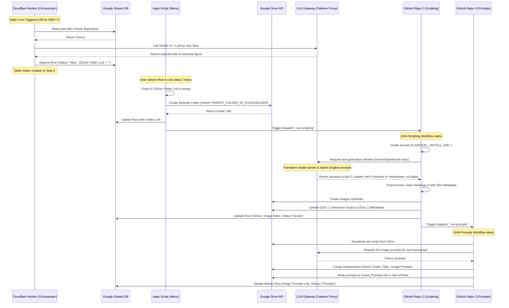

# 🚀 Quy Trình Tự Động Hóa Kịch Bản & Video: Góc Tối Pháp Luật (Kiến Trúc Tối Ưu)

Tài liệu này hướng dẫn chi tiết quy trình tự động hóa end-to-end cho kênh **Góc Tối Pháp Luật** (Kỳ án True Crime Việt Nam trầm ấm, sâu sắc, nhân văn). Quy trình được điều phối thông qua **Cloudflare Workers (Orchestrator)**, xử lý tác vụ nặng bằng **GitHub Actions (GHA)** kết hợp **Google Sheets / Google Drive API**, và bảo mật kết nối qua **LLM Gateway tập trung (Cloudflare Tunnel)**.

---

## 🗺️ Sơ Đồ Luồng Hệ Thống (Workflow Diagram)

---

## 🔑 1. Kiến Trúc Bảo Mật & LLM Gateway (Centralized Proxy)

Hệ thống sử dụng mô hình **LLM Gateway tập trung** làm proxy trung gian xử lý tất cả các cuộc gọi API. 

### Thành phần và Port chạy trên VPS:
* **`cli-proxy-api`** (Docker): Lắng nghe trên cổng nội bộ `8317`.
* **`9router`** (Next.js server): Lắng nghe trên cổng nội bộ `20128`.
* **`failover_proxy.js`** (Node.js): Lắng nghe trên cổng nội bộ **`8318`**. Đây là bộ định tuyến dự phòng chủ động, kết nối trực tiếp với Ngrok Tunnel (`unequaled-frankie-pseudoarchaically.ngrok-free.dev`).

### Quy tắc dịch tên Model & lọc ngôn ngữ:
Khi `ainovel-cli` hoặc các workflow gửi yêu cầu POST đến `/v1/chat/completions` của Failover Proxy (cổng `8318`):
1. **Dự phòng (Failover)**: Proxy thử gửi request đến `cli-proxy-api` (8317) trước. Nếu nhận lỗi `5xx` hoặc `429`, nó tự động chuyển tiếp yêu cầu sang `9router` (20128).
2. **Dịch tên mô hình (Model Translation)**:
   * Nếu gửi tới `cli-proxy-api`: Chuyển đổi `"google/gemini-2.5-flash"` thành `"gemini-2.5-flash"` (không có tiền tố).
   * Nếu gửi tới `9router`: Chuyển đổi `"google/gemini-2.5-flash"` thành `"gc/gemini-2.5-flash"` hoặc `"gemini/gemini-2.5-flash"` (thêm tiền tố `gc/` hoặc `gemini/`).
3. **Bộ lọc chữ Hán (Chinese Prompt Filter)**:
   * Proxy tự động chèn thêm chỉ thị tối cao vào `system message` của prompt để ép buộc AI viết truyện bằng tiếng Anh và **dịch toàn bộ các từ mô tả nhân vật/thân phận tiếng Trung** (như `侍女`, `皇帝`, `太后`...) sang tiếng Anh tương ứng (`maidservant`, `emperor`, `empress`).

---

## 📊 2. Thiết Kế Cơ Sở Dữ Liệu Google Sheets

### Bảng chính: `Episodes` (Theo dõi tiến độ từng tập phim)

| Cột | Tiêu đề cột | Mô tả |
| :--- | :--- | :--- |
| **A** | **ID** | Khóa chính duy nhất (UUID) của tập phim. |
| **B** | **Historical Figure** | Tên nhân vật lịch sử (Ví dụ: `Elizabeth I`). |
| **C** | **Video Title** | Tiêu đề SEO hoàn chỉnh được chọn. |
| **D** | **Status** | Trạng thái: `Idea` → `Script` → `Prompts` → `Rendered`. |
| **E** | **GDrive Folder Link** | Đường dẫn tới thư mục tập phim trên GDrive (Tạo tại Step 2). |
| **F** | **GDoc 1 (Script)** | Đường dẫn Google Doc chứa kịch bản giọng đọc (Voiceover sạch). |
| **G** | **GDoc 2 (Metadata)** | Đường dẫn Google Doc chứa mô tả SEO, hashtags và tags cho YouTube. |
| **H** | **Image Prompts (gsheet link)** | Đường dẫn file Google Sheet **độc lập** chứa câu lệnh vẽ ảnh. |
| **I** | **Image (gdrive link)** | Đường dẫn thư mục `Images/` lưu ảnh đã vẽ trên Google Drive. |
| **J** | **Date Created** | Thời gian khởi tạo dòng dữ liệu (Cột J). |
| **K** | **Voice** | Đường dẫn thư mục `Voiceovers/` lưu file giọng đọc trên Google Drive. |

---

## 📂 3. Cấu Trúc Repository trên GitHub

Dự án được đồng bộ lên kho lưu trữ GitHub thông qua 3 repo thành phần:

1. **`goctoiphapluat-step1-ideation`**:
   * Chứa mã nguồn Cloudflare Worker sinh ý tưởng.
2. **`goctoiphapluat-step2-scripting`**:
   * Quản lý workflow GHA để viết kịch bản qua `ainovel-cli`.
   * Tải `ainovel-cli` trực tiếp vào thư mục hiện tại (`AINOVEL_INSTALL_DIR=.`).
   * Sử dụng cấu hình `"genre": "goc-toi-phap-luat"` và bộ quy chuẩn đặt trong `.ainovel/rules/goc-toi-phap-luat.md`.
3. **`goctoiphapluat-step3-prompts`**:
   * Quản lý workflow GHA để băm phân cảnh và sinh SD prompts.

---

## ☁️ 4. Hoạt Động Của Cloudflare Worker (Step 1)
* **Ý tưởng**: Chạy daily cron vào lúc **00:01 GMT+7** (Hà Nội). Gọi Cloudflare Workers AI model `@cf/meta/llama-3.1-8b-instruct-fp8-fast` sinh ý tưởng vụ án True Crime Việt Nam mới tránh trùng lặp.
* **Ghi nhận Sheets**: Ghi dòng mới vào Sheet, đặt `Status` là `"Idea"`, và cột tạo ngày (J) là thời điểm hiện tại. **Chừa trống cột GDrive Folder Link (E)**.
* **Kiểm duyệt (Human-in-the-loop)**: Worker **không tự động kích hoạt kịch bản**. Nó chỉ chuẩn bị sẵn ý tưởng và tiêu đề trên Google Sheets để người dùng kiểm tra và chọn lọc trước.

---

## 🐙 5. Hoạt Động Của GHA Scripting (Step 2)
* **Bắt đầu**: Để hỗ trợ kiểm duyệt thủ công, **các lịch biểu tự động (Cron) trên GitHub Actions đã được gỡ bỏ**. Scripting chỉ chạy khi người dùng chọn dòng trên Google Sheet và bấm nút **`2. Run Step 2 (Scripting - Selected Row)`** trong menu Apps Script.
* **Tạo thư mục Drive**: Nếu ô `GDrive Folder Link` đang trống, Apps Script sẽ dùng `DriveApp` tự động tạo thư mục tập phim mới nằm trong thư mục cha có ID **`PARENT_FOLDER_ID_PLACEHOLDER`**, cập nhật link vào cột E rồi mới dispatch GHA.
* **Nguyên tắc viết kịch bản (TTS Compatibility)**:
   * **Chuyển số thành chữ**: Toàn bộ chữ số, ngày tháng, năm, số thập phân trong câu chuyện phải được viết hoàn toàn thành chữ tiếng Việt (Ví dụ: `1975` -> `một ngàn chín trăm bảy mươi lăm`, `2.5` -> `hai phẩy năm`).
   * Không chứa tiêu đề chương, đề mục lớn nhỏ, danh sách gạch đầu dòng, hay các đoạn hội thoại trực tiếp.
* **Tải lên**: Sau khi kịch bản hoàn thành (1 chương gồm 6 phân đoạn), script `upload_gdrive.py` sẽ đẩy kịch bản giọng đọc lên Google Drive dưới dạng Google Doc và cập nhật status sang `"Script"`.

---

## 🎬 6. Hoạt Động Của GHA Prompts (Step 3)
* **Bắt đầu**: Chạy nối tiếp tự động ngay sau khi kịch bản ở Step 2 hoàn thành tải lên Google Drive (hoặc chạy thủ công qua menu GSheet). Lịch biểu tự động (Cron) độc lập hàng ngày của Step 3 cũng đã được gỡ bỏ.
* **Đọc kịch bản**: Đọc kịch bản sạch từ GDoc, dùng LLM Gateway sinh prompt chi tiết cho từng đoạn văn xuôi.
* **Xuất các prompt**: Xuất các prompt này sang một file Google Sheet độc lập tên `[Video Title] - Image Prompts` nằm trong thư mục tập phim, cập nhật trạng thái master thành `"Prompts"`.

---

## ⚠️ 7. Nhật Ký Lỗi Hệ Thống & Lưu Ý Nhân Rộng Quy Trình (Troubleshooting & Replication Notes)

Dưới đây là tổng hợp các lỗi thực tế đã gặp phải và cách giải quyết để làm tài liệu đối chiếu khi nhân rộng quy trình cho các dự án tự động hóa tương tự:

### Lỗi 1: Thư mục Google Drive rác/trống khi chạy nháp
* **Triệu chứng**: Step 1 tự động tạo thư mục trên Google Drive mỗi khi lên ý tưởng. Nếu kịch bản không đạt yêu cầu hoặc không chạy tiếp, Drive sẽ bị tràn ngập thư mục trống vô nghĩa.
* **Bài học nhân rộng**: **Trì hoãn việc tạo thư mục (Lazy Creation)**. Để trống ô link Drive ở Step 1. Chỉ khi kịch bản được kích hoạt chạy (ở Step 2), Apps Script hoặc Runner mới bắt đầu tạo thư mục và ghi ngược lại Sheet.

### Lỗi 2: Trình cài đặt dòng lệnh (`ainovel-cli`) lỗi phân quyền trên máy ảo
* **Triệu chứng**: Workflow chạy lệnh tải binary từ repo chính nhưng gặp lỗi `No such file or directory` (Lỗi 127) do mặc định lưu vào thư mục hệ thống `/usr/local/bin` (nơi máy ảo GHA không cho phép ghi mà không có quyền sudo).
* **Bài học nhân rộng**: Thiết lập rõ biến môi trường đầu ra `AINOVEL_INSTALL_DIR=.` để ép trình cài đặt lưu trực tiếp file thực thi vào thư mục làm việc hiện tại của Actions runner, đảm bảo quyền chạy luôn được chấp nhận.

### Lỗi 3: Lỗi 502 / 500 do không khớp tên Model giữa các Proxy
* **Triệu chứng**: Cấu hình model mặc định là `google/gemini-2.5-flash`, trong khi `cli-proxy-api` chỉ hiểu `gemini-2.5-flash` và `9router` chỉ hiểu `gc/gemini-2.5-flash` hoặc `gemini/gemini-2.5-flash`. Request gửi đi bị các proxy local từ chối ngay lập tức.
* **Bài học nhân rộng**: Thiết kế Failover Proxy thông minh làm lớp bọc ngoài, tự động phân tích gói tin JSON và thực hiện **dịch tên mô hình (on-the-fly model translation)** phù hợp với từng cổng dịch vụ đích trước khi chuyển tiếp yêu cầu.

### Lỗi 4: Văn bản bị lẫn lộn Hán tự (chữ Trung Quốc)
* **Triệu chứng**: `ainovel-cli` có nguồn gốc Trung Quốc nên Coordinator tự động sinh thiết lập nhân vật kèm các từ khóa chữ Hán (ví dụ: `侍女`, `皇帝`...), khiến Writer đưa các từ này vào truyện.
* **Bài học nhân rộng**: Tận dụng Failover Proxy để chèn thêm một **chỉ thị tối cao (System Directive Injection)** vào đầu danh sách tin nhắn. Chỉ thị này ép buộc AI dịch mọi thuật ngữ và viết 100% bằng tiếng Việt chuẩn xác, ngăn chặn hoàn toàn Hán tự rò rỉ vào kịch bản.

### Lỗi 5: Chữ số thô (`1975`, `2.5`) phá hỏng chất lượng giọng đọc AI
* **Triệu chứng**: Công cụ Text-to-Speech (TTS) đọc các chữ số thô không mượt mà, gây mất cảm giác trầm ấm truyền cảm của video kỳ án.
* **Bài học nhân rộng**: Bắt buộc bổ sung quy định viết chữ thay cho số vào tài liệu phong cách kịch bản (`rules/goc-toi-phap-luat.md`) để AI tự động chuyển hóa thành chữ viết (ví dụ: `một ngàn chín trăm bảy mươi lăm`, `hai phẩy năm`).

