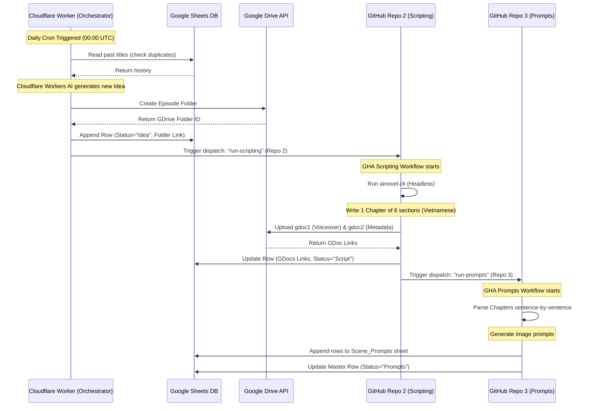

# ⚖️ Góc Tối Pháp Luật - Video Automation Project

Dự án này là hệ thống tự động hóa toàn diện từ ý tưởng, biên soạn kịch bản văn xuôi dài (7,500 - 8,500 từ), tạo các câu lệnh vẽ ảnh (image prompts) cho từng phân cảnh, và quản lý cơ sở dữ liệu trên Google Sheets & Google Drive.

---

## 🗺️ Quy Trình Tự Động Hóa (System Workflow)



---

## 📂 Cấu Trúc Thư Mục Dự Án (Project Structure)

Thư mục đã được tổng hợp đầy đủ từ `ainovel-cli` và các script bổ trợ tự động hóa:

```text
/media/vpsg16gb/Workspace/goctoiphapluat/
├── config.json                     # Cấu hình OpenRouter API cho ainovel-cli
├── api_config.json.example         # File cấu hình mẫu xoay vòng API Keys
├── .env.example                    # File biến môi trường mẫu
├── generate_goc_toi_phap_luat.py   # Script Python sinh kịch bản cuốn chiếu (section-by-section)
├── README.md                       # Tài liệu hướng dẫn sử dụng (File này)
├── handoff.md                      # Tài liệu bàn giao dự án ban đầu
├── Quy_Trinh_Tu_Dong_Hoa_Goc_Toi_Phap_Luat.md # Tài liệu mô tả quy trình hệ thống
│
├── bin/
│   └── ainovel-cli                 # File chạy (binary) của ainovel-cli
│
├── rules/
│    └── goc-toi-phap-luat.md        # File rule ép buộc văn phong, độ dài và định dạng Góc Tối Pháp Luật (tiếng Việt)
│
├── scripts/
│   ├── google_api_helper.py        # Thư viện dùng chung kết nối Sheets và Drive
│   ├── organize_sheet.py           # Script định dạng, tạo các cột & tab của Google Sheet
│   ├── post_process.py             # Script gom chương thành gdoc1.txt và tách Metadata thành gdoc2.txt
│   ├── upload_gdrive.py            # Script tải file kịch bản/metadata lên Drive và cập nhật link GSheet
│   ├── download_script.py          # Script tải kịch bản từ Google Doc về local dưới dạng raw text
│   ├── generate_prompts.py         # Script chia nhỏ kịch bản và gọi Gemini để sinh SD Image Prompts
│   ├── update_status.py            # Script cập nhật trạng thái trong sheet Episodes (Master)
│   └── check_chapter_wordcount.py   # Script kiểm tra độ dài các chương của ainovel-cli
│
├── cloudflare/
│   ├── wrangler.toml               # Cấu hình dự án Cloudflare Workers
│   └── src/
│       └── index.js                # Mã nguồn điều phối Orchestrator chính
│
└── .github/
    └── workflows/
        ├── scripting.yml           # GHA Workflow Step 2 (Chạy viết kịch bản)
        └── prompts.yml             # GHA Workflow Step 3 (Chạy sinh câu lệnh vẽ ảnh)
```

---

## 🔑 Hướng Dẫn Thiết Lập Phân Quyền (Permissions)

Để các script tự động hóa có thể đọc ghi dữ liệu trên Google Sheets & Google Drive, bạn cần chia sẻ (Share) Spreadsheet của mình:

1. **Spreadsheet ID**: `SPREADSHEET_ID_PLACEHOLDER`
2. **Email cần share quyền Editor**:
   ```text
   n8n-sheets@make-240717.iam.gserviceaccount.com
   ```
3. Chia sẻ thư mục cha (Parent Folder) trên **Google Drive** của bạn với email trên để hệ thống có quyền tạo thư mục tập phim mới.

---

## 🚀 Cách Sử Dụng Các Script Bổ Trợ

### 1. Khởi Tạo & Định Dạng Google Sheet
Chạy script này để tự động thiết kế các tab `goctoiphapluat` (Master) và `Scene_Prompts` (Bảng con quản lý ảnh) với tiêu đề cột đúng chuẩn và định dạng chuyên nghiệp:
```bash
python3 scripts/organize_sheet.py
```

### 2. Sinh Kịch Bản Độc Lập Qua CLI
Nếu muốn sinh kịch bản ngay trên máy local thay vì qua GHA:
```bash
./bin/ainovel-cli --headless --prompt "Viết kịch bản chi tiết về vụ án Bạch Hải Đường theo phong cách kịch bản Góc Tối Pháp Luật."
```
Sau đó chạy gom chương và tách metadata:
```bash
python3 scripts/post_process.py
```

### 3. Quy Trình Chạy Từng Bước (Cho GHA/Local)
* **Tải kịch bản xuống**:
  ```bash
  export EPISODE_ID="MÃ_UUID_CỦA_TẬP_PHIM"
  python3 scripts/download_script.py
  ```
* **Tự động sinh Image Prompts và tải lên GSheet**:
  ```bash
  export GEMINI_API_KEYS="key1,key2,key3"
  python3 scripts/generate_prompts.py
  ```
* **Cập nhật trạng thái**:
  ```bash
  python3 scripts/update_status.py
  ```
