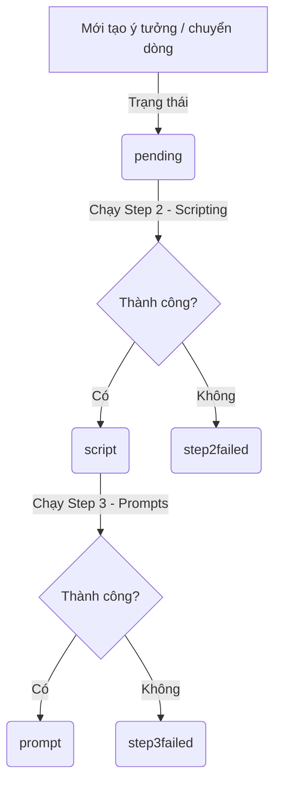

# 🤝 BÀN GIAO DỰ ÁN - GÓC TỐI PHÁP LUẬT AUTOMATION PIPELINE
*(Cập nhật ngày 02/07/2026)*

Tài liệu hướng dẫn chi tiết quy trình cấu hình, quản lý các GitHub Secrets, cấu hình VPS định tuyến và hướng dẫn vận hành hệ thống viết truyện tự động 100% cho kênh **Góc Tối Pháp Luật**.

---

## 📌 1. Danh Sách GitHub Repositories Đã Khởi Tạo
Cả 3 kho lưu trữ (chế độ **Public** để được miễn phí số giờ chạy máy ảo vô hạn từ GitHub) đã được khởi tạo thành công trên tài khoản của bạn:
1. **`goctoiphapluatpipeline`**: Nơi lưu giữ toàn bộ mã nguồn chính của dự án chạy trên VPS.
2. **`goctoiphapluat-step2-scripting`**: Nơi kích hoạt GHA viết kịch bản tự động (Step 2).
3. **`goctoiphapluat-step3-prompts`**: Nơi kích hoạt GHA phân cảnh và tạo prompt ảnh (Step 3).

---

## ⚙️ 2. Hướng Dẫn Cài Đặt GitHub Secrets
Truy cập vào phần cài đặt Secret (**Settings -> Secrets and variables -> Actions**) của cả hai Repository `goctoiphapluat-step2-scripting` và `goctoiphapluat-step3-prompts` để thêm các Secrets sau:

| Tên Secret | Giá trị cần điền | Ghi chú |
| :--- | :--- | :--- |
| **`GATEWAY_URL`** | `https://unequaled-frankie-pseudoarchaically.ngrok-free.dev/v1` | URL Ngrok định tuyến về VPS |
| **`GATEWAY_TOKEN`** | `sk-225f4ad2e9fb692e-2kwh0i-b1a15c74` | API Key kết nối LLM |
| **`SPREADSHEET_ID`** | `1FXYJOhyMxNpUNYpLf5O6Tf6UehI1ulHa_B8HzwTkmdM` | ID của Google Sheet Góc Tội Pháp Luật |
| **`GDRIVE_PARENT_FOLDER_ID`** | `1BABIF2g-U6RqAgNyjs7hOACOiPmFvYPC` | ID Thư mục cha trên Google Drive |
| **`GOOGLE_SERVICE_ACCOUNT_TOKEN`**| `{ ... }` *(Copy toàn bộ nội dung file `user_oauth2.json`)* | Quyền ghi Sheets/Drive (Hạn mức 5 TB) |

> [!IMPORTANT]  
> Các Secrets trên GitHub luôn được mã hóa và bảo mật hoàn toàn, tuyệt đối không bị lộ kể cả khi repository ở chế độ Public.

---

## 🛡️ 3. Quy Trình Vận Hành & Trạng Thái Hệ Thống
Hệ thống sử dụng các trạng thái chuẩn hóa (viết thường, số ít) để kiểm soát quy trình chạy đơn và chạy hàng loạt (Batch cron) không bị lỗi lặp:

### Chi tiết các nút chức năng trên Google Sheets:
* **`0. Trigger All (Active Row)`**: Chạy cả quy trình từ ý tưởng cho đến prompts cho dòng hiện tại.
* **`1. Run Step 1 (New Idea)`**: Gọi Cloudflare Worker sinh ý tưởng vụ án mới ghi vào tab `ideation`.
* **`2a. Run Step 2 - Selected Row`**: Chạy Step 2 cho riêng dòng đang chọn. Trạng thái sẽ cập nhật thành `script` hoặc `step2failed` nếu lỗi.
* **`2b. Run Step 2 - All Pending Rows`**: Chạy quét từ trên xuống dưới các dòng có trạng thái `pending` và tự viết kịch bản nối tiếp.
* **`3a. Run Step 3 - Selected Row`**: Chạy Step 3 sinh 19 prompt ảnh cho dòng đang chọn. Trạng thái sẽ cập nhật thành `prompt` hoặc `step3failed` nếu lỗi.
* **`3b. Run Step 3 - All Script Rows`**: Chạy quét tất cả các dòng có trạng thái `script` để sinh prompts.
* **`4. Check Duplication (Proposal C1)`**: So sánh ô `C1` của tab `ideation` với cột vụ án của `goctoiphapluat` để tránh trùng lặp.
* **`5. Move Chosen Rows to goctoiphapluat`**: Chuyển các vụ án được duyệt (`chosen` ở cột Status của tab `ideation`) sang bảng chính với trạng thái `pending`.

---

## 🛠️ 4. Cấu Hình VPS & Cải Tiến Proxy
* **Failover Proxy (Port 8318)**: Đã được cập nhật bộ lọc ngôn ngữ thông minh. Khi nhận yêu cầu từ Góc Tội Pháp Luật (Tiếng Việt), proxy sẽ tự động bỏ qua chỉ thị ép tiếng Anh (chỉ áp dụng cho History Snooze) để sinh câu chuyện tiếng Việt chuẩn xác.
* **Đảm bảo stream không lỗi**: Failover Proxy tự động chèn thêm tín hiệu kết thúc stream `[DONE]` để khắc phục triệt để lỗi crash `stream ended before [DONE]` của `ainovel-cli`.
